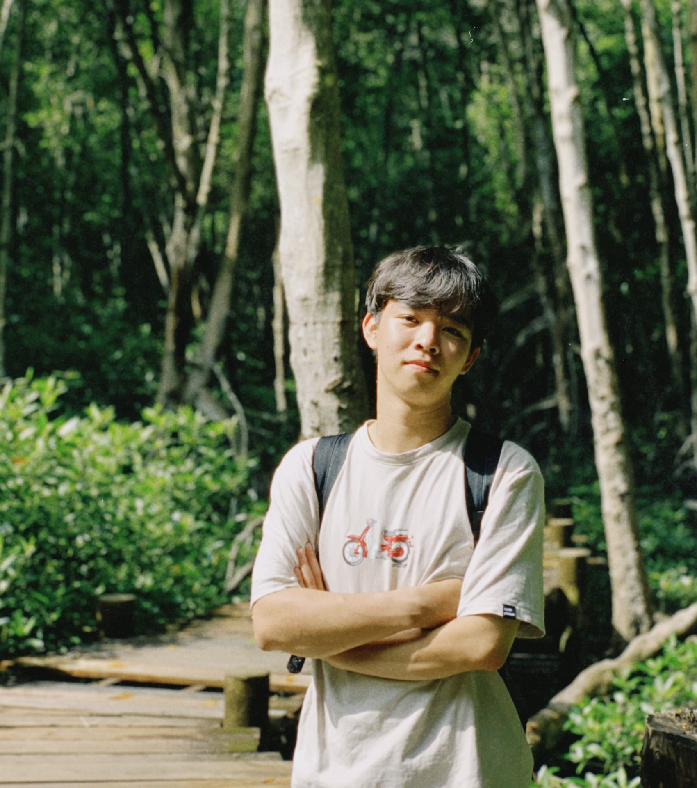

# Bui Vi Quoc

- 👶**Birthday**: 10/02/2003
- 🏰**Address**: Ho Chi Minh, Vietnam

## 🙋🏻‍♂️Brief introduction

> Hi, I'm a student who can code and learn about technology all day without getting tired.

I started learning to code three years ago, mainly about C++ and competition programming (data structures & algorithms). That helped me win some achievements and get a position as a programming instructor at an academy.

In the past year, I have been very focused on learning web programming. And I'm trying to be a good software engineer.

## 🥇Achievements

- Second Prize - **The 31st Vietnam Student Olympiad in Informatics (OLP'22)**
- Ranked 80 in the World - **IEEEXtreme 16.0**
- Honorable Prize - **Vietnamese Olympiad in Informatics 2020**
- Second Prize - **Daknong Province Olympiad in Informatics 2018-2019, 2019-2020**
- Gold Medal - **Daknong Province Olympiad 2018**
- First Prize - **Daknong Young Informatics Contest XIII**
- First Prize - **Vinfast F1 Race - STEME DAY 2020**
- TOP10 - **Vietnam Online Hackathon 2020**

## 💻Work experience

### **Fullhouse** | Programming Instructor (Part-time)

**Time:** 03/2022 - now

**Description:**

- Teaching C++ and data structures & algorithms
- Website administrator laptrinh24h.vn

### **[thuocsi.vn](https://thuocsi.vn)** | Software Engineer Intern

**Time:** 11/2021 - 02/2022

**Description:** Use Golang programming language to write functions, APIs, middlewares. Occasionally I am tasked with debugging and maintaining codes.

### **[luyencode.net](https://luyencode.net)** | Developer & Administrator

**Time:** 01/2021 - now

**Description:** System development, operation and maintenance.

## 🔧Skills

### 🔠Programming Languages

- C++

- Javascript, TypeScript.

- Golang

> I'm quite confident that I can catch up with other languages when needed very quickly.

### 💻Web Front-end Technologies

React, React Query, Redux, Styled Components, TailwindCss, Sass, Webpack, HTML5, CSS3.

### 🧮Web Back-end Technologies

- Protocols: REST, HTTP(S)
- Frameworks/Libraries: Node.js, Json Server
- Cloud Services: Vercel, Netlify
- Database: Firebase, MongoDb, SQL

### 🔨Dev Tools

Git, Postman, React Developer Tool, Redux Dev Tool, React Query Dev Tool, Github, Figma, VS Code, Bash

### 💁🏻‍♂️Industrial & Interpersonal Skills

Present, Teamwork

## 📚Education

**University of Information Technology - VNUHCM**
Bachelor of Software Engineering | 2021-2025

## 💋Languages

- **English:** Read and understand specialized documents.

- **Vietnamese:** Native speaker.

## ☎️Contact information

- 📞Phone: (+84) 905 310 437
- 📧Email: [bvquoc.dev@gmail.com](mailto:bvquoc.dev@gmail.com)
- ✍🏻Website: [https://bvquoc-portfolio.vercel.app/](https://bvquoc-portfolio.vercel.app/)
- 🔗Github: [https://github.com/bvquoc/](https://github.com/bvquoc/)
- 🔗Facebook: [https://www.facebook.com/bviquoc/](https://www.facebook.com/bviquoc/)

## 🙏🏻Thanks!

> Looking forward to hearing from you - Bui Vi Quoc
